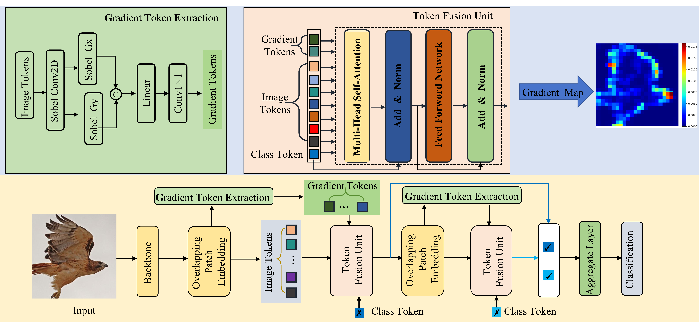

# Gradient-Aware Token Injection Transformer for Fine-Grained Visual Classification

## Training


Put the pre-trained model(https://drive.google.com/file/d/17sUNST7ivQhonBAfZEiTOLAgtaHa4F3e/view?usp=sharing)
* install `Pytorch and torchvision`
```
pip install torch==1.13.1 torchvision==0.14.1
```
* install `timm`
```
pip install timm==0.4.5
```
* install `Apex`
```
git clone https://github.com/NVIDIA/apex
cd apex
pip install -v --disable-pip-version-check --no-cache-dir --global-option="--cpp_ext" --global-option="--cuda_ext" ./
```
* install other requirements
```
pip install opencv-python==4.5.1.48 yacs==0.1.8
```
## data preparation
#### data preparation
Download [iNaturalist 18](https://github.com/visipedia/inat_comp),[CUB-200-2011](http://www.vision.caltech.edu/visipedia/CUB-200-2011.html),[NABirds](https://dl.allaboutbirds.org/nabirds),[Stanford Cars](https://ai.stanford.edu/~jkrause/cars/car_dataset.html).

## Trained Model Checkpoints

We provide the trained model checkpoints on the following datasets. You can download and evaluate them directly.

```
datasets
  |————inraturelist2018
  |       └——————train_val_images
  |       └——————train2018.json
  |       └——————val2018.json
  |       └——————train2018_locations.json
  |       └——————val2018_locations.json
  |       └——————categories.json.json
  |————cub-200
  |       └——————...
  |————nabirds
  |       └——————...
  |————stanfordcars
  |       └——————car_ims
  |       └——————cars_annos.mat

```
You can dowmload pre-trained model from model zoo, and put them under \<root\>/pretrained.
To train MetaFG on datasets, run:
```
python3 -m torch.distributed.launch --nproc_per_node <num-of-gpus-to-use> --master_port 12345  main.py --cfg /configs/FT_Former_NABirds.yaml --dataset NABirds --pretrain /raid/test/MetaFormer/pretrained_model/metafg_2_inat21_384.pth --batch-size 16 --output <output-directory> --tag <job-tag>
```
\<dataset-name\>:inaturelist2018,cub-200,nabirds,stanfordcars
For NABirds, run:
```
CUDA_VISIBLE_DEVICES=0,1 python3 -m torch.distributed.launch --nproc_per_node 2 --master_port 12345  main.py --cfg /configs/GATIT.yaml.yaml --batch-size 16 --tag NABirds --lr 5e-5 --min-lr 5e-7 --warmup-lr 5e-8 --epochs 300 --warmup-epochs 20 --dataset NABirds --pretrain /pretrained_model/metafg_2_inat21_384.pth --accumulation-steps 2 --opts DATA.IMG_SIZE 384
```
To evaluate model on dataset,run:
```
python3 -m torch.distributed.launch --nproc_per_node <num-of-gpus-to-use> --master_port 12345  main.py --eval --cfg <config-file> --dataset <dataset-name> --resume <checkpoint> [--batch-size <batch-size-per-gpu>]
```

We provide the trained model checkpoints on the following datasets. You can download and evaluate them directly

- **Gradient-Aware Token Injection Transformer for Fine-Grained Visual Classification trained on Datasets**  
  🔗 [Baidu Pan Link](https://pan.baidu.com/s/19sEDgygYqXA03vmBfsX0Vw?pwd=i25h)  
  🔐 Password: `i25h` 

## Acknowledgment
We would like to thank the authors of [MetaFormer](https://github.com/dqshuai/MetaFormer)for their publicly available code. Part of this work is built upon their implementations.

